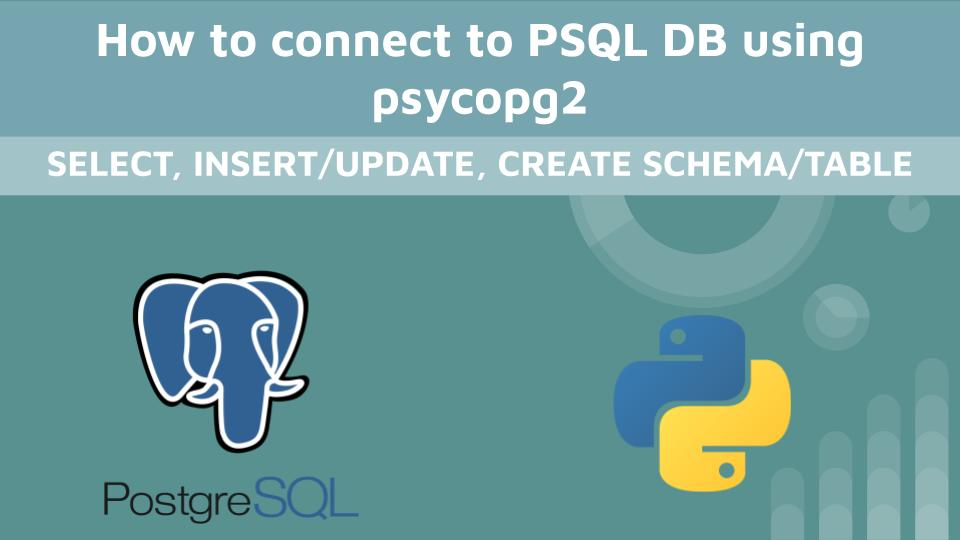
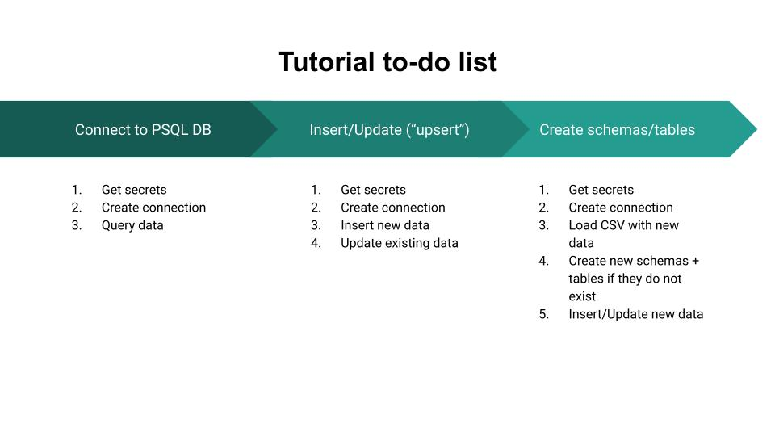

# psycopg2-python-tutorial

Basic tutorial on how to use [`psycopg2`](https://www.psycopg.org/docs/index.html) to connect to a PostgreSQL database and make changes.

This repo is part of the YouTube video [How to connect to PSQL DB using psycopg2](https://www.youtube.com/)

## Connecting to PSQL Database

- `connect-to-psql-db.ipynb`

## Insert/Update data 

- `insert-new-weather-data.ipynb`

## Create schemas/tables and insert data

- `new-schemas-tables-insert.ipynb`

